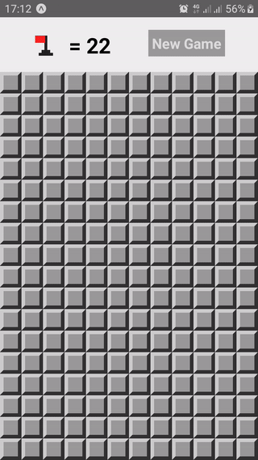

# REACT NATIVE MINING FIELD GAME

This is one simple mining field game made with Facebook's React Native and Expo.

    

# Instructions

- Clone the repo
- Run `yarn` or `npm i` to install the dependencies
- Run `expo start` to start the project

# How to play

- Short press to uncover field
- Long press to place a flag
- Touch on the big flag at the top of the screen to change the difficulty level